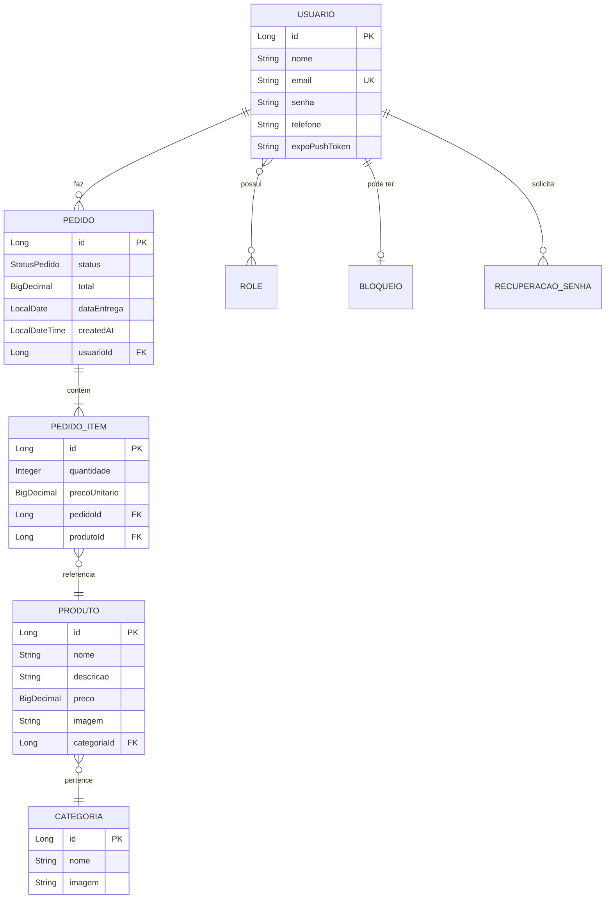

<h1 align="center">🍰 DaniCake — Backend API</h1>

<p align="center">
  <strong>API REST para o sistema de encomendas de bolos e doces artesanais</strong>
</p>

<p align="center">
  
  
  
  
</p>

<p align="center">
  
  
  
  
</p>

---

## 📖 Sobre o Projeto

A **API DaniCake** (internamente chamada **Receitix**) é o backend responsável por toda a lógica de negócios do aplicativo DaniCake. Construída com **Spring Boot 3**, ela fornece uma API REST completa e segura para gerenciar usuários, produtos, categorias, pedidos e muito mais.

O sistema utiliza **autenticação JWT**, possui **recuperação de senha** via e-mail (SMTP) e SMS (Twilio), e conta com **CI/CD automatizado** via Jenkins + Docker.

---

## ✨ Funcionalidades da API

### 🔐 Autenticação & Segurança
| Endpoint | Descrição |
|---|---|
| `POST /auth/login` | Autenticação com JWT |
| `POST /auth/register` | Registro de novo usuário |
| `POST /auth/recovery` | Recuperação de senha (e-mail/SMS) |
| 🛡️ **Spring Security** | Proteção de rotas por roles (ADMIN/USER) |
| 🔑 **JWT Filter** | Filtro de autenticação por token |

### 🎂 Gestão de Produtos
| Endpoint | Descrição |
|---|---|
| `GET /produtos` | Listar todos os produtos |
| `POST /produtos` | Criar produto (ADMIN) |
| `PUT /produtos/{id}` | Atualizar produto (ADMIN) |
| `DELETE /produtos/{id}` | Remover produto (ADMIN) |

### 🏷️ Categorias
| Endpoint | Descrição |
|---|---|
| `GET /categorias` | Listar categorias |
| `POST /categorias` | Criar categoria (ADMIN) |
| `PUT /categorias/{id}` | Atualizar categoria (ADMIN) |
| `DELETE /categorias/{id}` | Remover categoria (ADMIN) |

### 📦 Pedidos
| Endpoint | Descrição |
|---|---|
| `GET /pedidos` | Listar pedidos do usuário |
| `POST /pedidos` | Criar novo pedido |
| `PUT /pedidos/{id}/status` | Atualizar status (ADMIN) |
| `GET /pedidos/admin` | Listar todos os pedidos (ADMIN) |

### 🖼️ Imagens
| Endpoint | Descrição |
|---|---|
| `POST /images/upload` | Upload de imagem de produto |
| `GET /images/{filename}` | Recuperar imagem |

### 👤 Usuários
| Endpoint | Descrição |
|---|---|
| `GET /usuarios/me` | Dados do usuário logado |
| `PUT /usuarios/me` | Atualizar perfil |
| `GET /usuarios` | Listar usuários (ADMIN) |

---

## 🏗️ Arquitetura do Projeto

```
ProjetoAPP/
├── 📄 Dockerfile                  # Build multi-stage para produção
├── 📄 docker-compose.yml          # Orquestração de containers
├── 📄 Jenkinsfile                 # Pipeline CI/CD (Windows)
├── 📄 JenkinsfileLinux            # Pipeline CI/CD (Linux)
├── 📄 pom.xml                     # Dependências Maven
└── 📂 src/main/java/com/yasmin/receitix/
    ├── 📄 ReceitixApplication.java    # Classe principal
    ├── 📂 config/                     # Configurações
    │   ├── SecurityConfiguration      # Configuração do Spring Security
    │   ├── UserAuthenticationFilter   # Filtro JWT
    │   ├── OpenApiConfig              # Swagger/OpenAPI
    │   └── ModelMapperConfig          # Mapeamento de objetos
    ├── 📂 controllers/                # Camada de apresentação
    │   ├── UsuarioController          # Endpoints de usuários
    │   ├── ProdutoController          # Endpoints de produtos
    │   ├── CategoriaController        # Endpoints de categorias
    │   ├── PedidoController           # Endpoints de pedidos
    │   ├── PedidoItemController       # Endpoints de itens do pedido
    │   ├── ImageController            # Endpoints de imagens
    │   ├── RecuperacaoSenhaController # Endpoints de recuperação de senha
    │   └── ApresentacaoController     # Endpoint de health check
    ├── 📂 entity/                     # Entidades JPA
    │   ├── Usuario                    # Entidade de usuário
    │   ├── Produto                    # Entidade de produto
    │   ├── Categoria                  # Entidade de categoria
    │   ├── Pedido                     # Entidade de pedido
    │   ├── PedidoItem                 # Entidade de item do pedido
    │   ├── Role / RoleName            # Roles de autorização
    │   ├── Bloqueio                   # Bloqueio de contas
    │   └── RecuperacaoSenha           # Tokens de recuperação
    ├── 📂 DTO/                        # Data Transfer Objects
    │   ├── CreateUserDTO
    │   ├── LoginUserDTO
    │   ├── RecoveryJwtTokenDTO
    │   ├── 📂 request/               # DTOs de requisição
    │   └── 📂 response/              # DTOs de resposta
    ├── 📂 enums/                      # Enumerações
    │   ├── StatusPedido               # Status dos pedidos
    │   └── CanalRecuperacao           # Canais de recuperação (EMAIL/SMS)
    ├── 📂 repository/                 # Repositórios JPA
    │   ├── UsuarioRepository
    │   ├── ProdutoRepository
    │   ├── CategoriaRepository
    │   ├── PedidoRepository
    │   ├── PedidoItemRepository
    │   └── ...
    └── 📂 service/                    # Camada de negócios
        ├── UsuarioService             # Lógica de usuários + autenticação
        ├── ProdutoService             # Lógica de produtos
        ├── CategoriaService           # Lógica de categorias
        ├── PedidoService              # Lógica de pedidos
        ├── PedidoItemService          # Lógica de itens de pedido
        ├── JwtTokenService            # Geração/validação de JWT
        ├── EmailService               # Envio de e-mails (SMTP)
        ├── SmsService                 # Envio de SMS (Twilio)
        ├── ImageService               # Gerenciamento de imagens
        ├── PushNotificationService    # Notificações push (Expo)
        ├── RecuperacaoSenhaService    # Fluxo de recuperação de senha
        └── UserDetailsServiceImpl     # Implementação Spring Security
```

---

## 🚀 Tecnologias Utilizadas

<p align="center">
  <a href="https://skillicons.dev">
    
  </a>
</p>

| Tecnologia | Versão | Descrição |
|---|---|---|
| **Java** | 21 (LTS) | Linguagem principal |
| **Spring Boot** | 3.5.5 | Framework backend |
| **MySQL** | 8+ | Banco de dados relacional |
| **Docker** | — | Containerização |
| **Jenkins** | — | Pipeline CI/CD |
| **Maven** | 3.9+ | Gerenciador de dependências |

### 📦 Dependências Principais

| Dependência | Uso |
|---|---|
| `spring-boot-starter-web` | API REST |
| `spring-boot-starter-data-jpa` | ORM/Persistência com Hibernate |
| `spring-boot-starter-security` | Autenticação e autorização |
| `spring-boot-starter-mail` | Envio de e-mails (recuperação de senha) |
| `java-jwt` (Auth0) | Geração e validação de tokens JWT |
| `springdoc-openapi` | Documentação Swagger/OpenAPI |
| `modelmapper` | Mapeamento Entity ↔ DTO |
| `mysql-connector-j` | Driver MySQL |
| `h2` | Banco em memória para testes |

---

## 🔒 Segurança

O sistema implementa múltiplas camadas de segurança:

```
┌─────────────────────────────────────────────┐
│              Requisição HTTP                 │
├─────────────────────────────────────────────┤
│     UserAuthenticationFilter (JWT)          │
│     ↓ Valida token no header Authorization  │
├─────────────────────────────────────────────┤
│     SecurityConfiguration                   │
│     ↓ Verifica roles (ADMIN / USER)         │
├─────────────────────────────────────────────┤
│     Controller → Service → Repository       │
│     ↓ Lógica de negócios                    │
├─────────────────────────────────────────────┤
│     MySQL Database                          │
└─────────────────────────────────────────────┘
```

| Recurso | Implementação |
|---|---|
| **Autenticação** | JWT Bearer Token (Auth0 java-jwt) |
| **Autorização** | Roles ADMIN/USER via Spring Security |
| **Senhas** | BCrypt hashing |
| **Recuperação** | Código temporário via e-mail ou SMS |
| **Secrets** | Infisical (gerenciador de segredos) |

---

## ⚙️ Como Executar

### 📋 Pré-requisitos

- [Java 21](https://www.oracle.com/java/technologies/downloads/) (JDK)
- [Maven](https://maven.apache.org/) 3.9+
- [MySQL](https://www.mysql.com/) 8+ (ou use H2 para testes)
- [Docker](https://www.docker.com/) (opcional, para deploy)

### 🔧 Configuração

Crie um arquivo `.env` na raiz do projeto com as variáveis:

```env
# Banco de Dados
DB_URL=jdbc:mysql://localhost:3306/danicake
DB_USERNAME=root
DB_PASSWORD=sua_senha

# JWT
JWT_SECRET=sua_chave_secreta_jwt

# E-mail (Recuperação de Senha)
MAIL_HOST=smtp.gmail.com
MAIL_PORT=587
MAIL_USERNAME=seu_email@gmail.com
MAIL_PASSWORD=sua_senha_de_app

# SMS - Twilio (Opcional)
TWILIO_ACCOUNT_SID=seu_sid
TWILIO_AUTH_TOKEN=seu_token
TWILIO_PHONE_NUMBER=+15555555555
```

### ▶️ Executando Localmente

```bash
# Clone o repositório
git clone https://github.com/Yasmin-Braga7/ProjetoAPP.git

# Entre na pasta do projeto
cd ProjetoAPP

# Execute com Maven
./mvnw spring-boot:run
```

> O servidor estará disponível em `http://localhost:8402`

### 🐳 Executando com Docker

```bash
# Build e execução com Docker Compose
docker-compose up -d --build
```

### 📚 Documentação da API (Swagger)

Após iniciar o servidor, acesse:

```
http://localhost:8402/swagger-ui/index.html
```

---

## 🔄 Pipeline CI/CD

O projeto utiliza **Jenkins** para deploy automatizado:

```
┌──────────┐    ┌──────────────┐    ┌──────────────┐    ┌──────────┐
│ Git Push │───▸│   Checkout   │───▸│  Maven Build │───▸│  Docker  │
│  (main)  │    │  Repositório │    │  + Install   │    │  Build   │
└──────────┘    └──────────────┘    └──────────────┘    └────┬─────┘
                                                             │
                ┌──────────────┐    ┌──────────────┐    ┌────▼─────┐
                │   Deploy ✅   │◂───│  Infisical   │◂───│  Docker  │
                │   Completo   │    │   Secrets    │    │  Deploy  │
                └──────────────┘    └──────────────┘    └──────────┘
```

| Stage | Descrição |
|---|---|
| **Checkout** | Clona a branch `main` do repositório |
| **Instalar Dependências** | Executa `mvn clean install` |
| **Construir Imagem** | Build da imagem Docker |
| **Deploy** | Injeta secrets do Infisical e sobe o container |

---

## 📊 Modelo de Dados



---

## 🔗 Repositórios Relacionados

<p align="center">
  <a href="https://github.com/Yasmin-Braga7/DaniCake-FRONTEND">
    
  </a>
</p>

---

## 👩‍💻 Desenvolvedora

<p align="center">
  <a href="https://github.com/Yasmin-Braga7">
    
  </a>
</p>

---

<p align="center">
  Feito com 💗 e muito ☕ por <strong>Yasmin Braga</strong>
</p>
